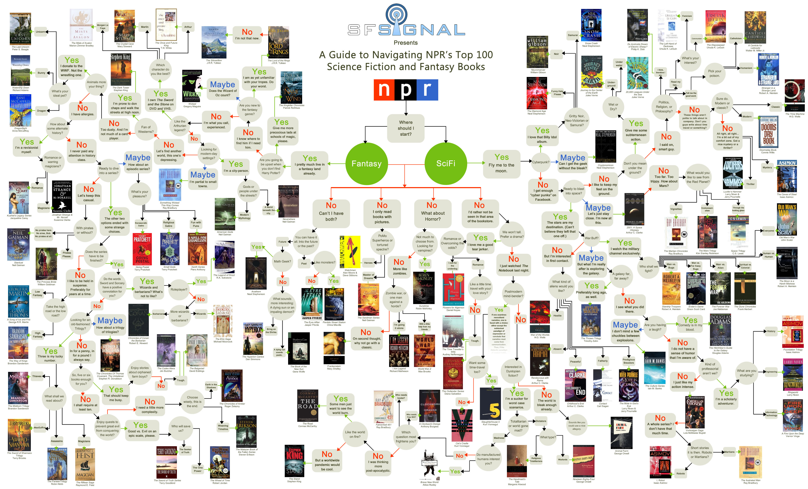

# 📚 Sci-Fi & Fantasy Book Quiz

Demo: [link](https://ninelka.github.io/book-choice-quiz/) 👈

> _“One day, I came across an amazing flowchart created by SFSignal and NPR — a branching guide to the Top 100 Science Fiction and Fantasy Books. I thought: what if I could bring that interactive experience to life on the web?”_

This project transforms NPR’s classic **Top 100 Sci-Fi & Fantasy Books Flowchart** into a **fully interactive React-based quiz app**. It guides users through a series of questions, mimicking the original visual chart’s logic, and recommends a book based on their choices.

---

## 🧩 The Original Flowchart



---

## ✨ Features

- 📘 Interactive book recommendation quiz based on the NPR Top 100 list
- 🌿 Fully dynamic structure powered by `quizFlow.json` logic
- 🖼️ Images of recommended book covers from https://openlibrary.org/
- 💡 Easy to customize — add or change questions via a single config file

---

## 🌍 Multilingual Support

The app now supports **English** and **Russian**.

You can switch languages anytime using the dropdown menu at the top of the quiz interface.

---

## 🧠 Customization

Want to adjust the quiz or expand it with more books?

- Modify the `quizFlow.json` file to add questions, answers, or outcomes.
- Update the `/public/images/` folder with new cover images if needed.

---

## 🚀 How to run locally

### 1. Clone the repo

```bash
git clone https://github.com/Ninelka/book-choice-quiz.git
cd book-choice-quiz
```

### 2. Install dependencies

```bash
npm install
```

### 3. Start the development server

```bash
npm run dev
```

---

## 📦 Build for Production

```bash
npm run build
```

---

## 📬 License

MIT — Free to use, extend, or remix for your own projects
